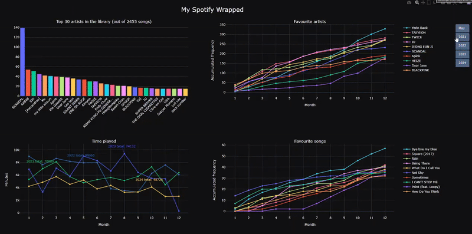

# My Spotify Wrapped: Analyzing My Own Spotify Data and Creating an Interactive Dashboard with Plotly

This repository contains the code I used to analyze my Spotify listening history from 2021 to 2024. 

If you're interested in a breakdown of my analysis and insights, feel free to check out my Medium article:

[*My Spotify Wrapped: Analyzing My Own Spotify Data and Creating an Interactive Dashboard with Plotly*](https://medium.com/@kinran_lau/my-spotify-wrapped-analyzing-my-own-spotify-data-and-creating-an-interactive-dashboard-with-plotly-a601ba7516dc)

---
🔍 **Overview**

*Data Analysis:* `spotify_analysis.ipynb` processes and visualizes my Spotify listening data.

*Interactive Dashboard*: You can explore my interactive dashboard by downloading and opening `My Spotify Wrapped_animated.html` in a browser—no extra installation required.

*Not included (for privacy reasons):*

- `StreamingHistory0.json` to `StreamingHistory10.json` (Spotify listening history)

- `YourLibrary.json` (Spotify library)

---
🚀 **How to Use This Code**

Download your own Spotify data (.json) from the [Spotify Privacy Settings](https://www.spotify.com/account/privacy) page.

Adapt the code in `spotify_analysis.ipynb` to match your dataset.

Run the notebook to generate insights and create your own interactive dashboard.
